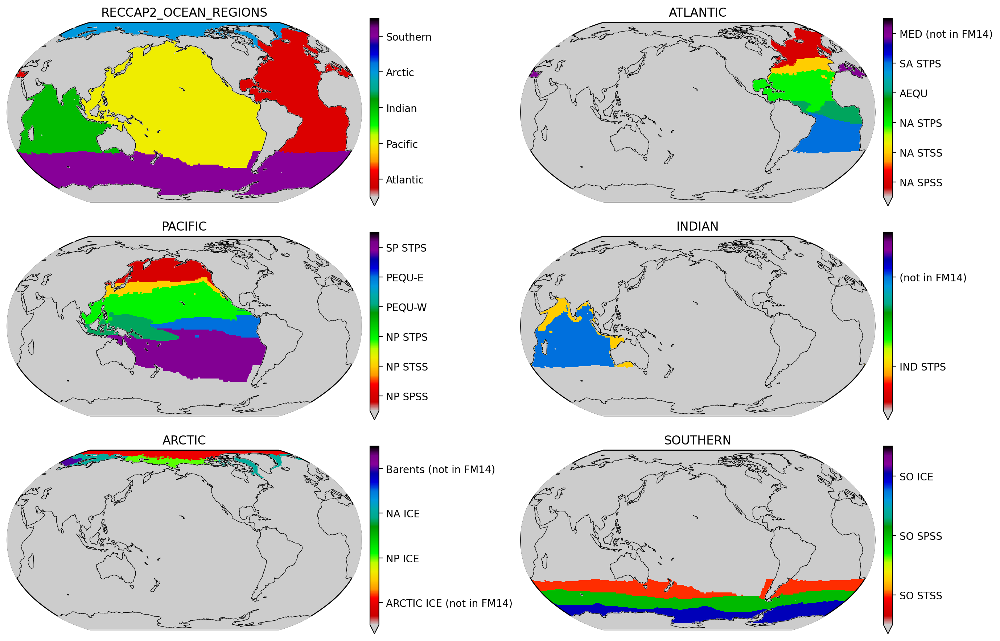
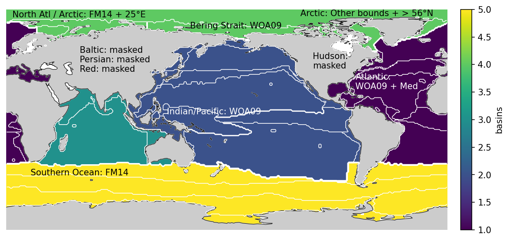

## RECCAP2-ocean regions 
A netCDF file with regional masks is available at [https://github.com/RECCAP2-ocean/shared-resources/raw/master/regions/RECCAP2_region_masks_all.nc](https://github.com/RECCAP2-ocean/shared-resources/raw/master/regions/RECCAP2_region_masks_all.nc). This file contains the `open_ocean` mask and the sub-regions for each basin: `atlantic, pacific, indian, arctic, southern`. Further, a `coastal_marcats` mask is included. All land, or non-valid regions of the masks are set to zero. 

We have used the biomes of Fay and McKinley to divide the basins into subregions. 
The areas where FM14 does not have data have been ingested by the neighboring biome or a new distinct biome has been added, as noted in the figure below. 

## Coastal regions
The coastal regions will be the MARCATS product by [Laruelle et al. 2013](https://hess.copernicus.org/articles/17/2029/2013/). These coastal regions are defined by catchment areas and marginal shelf extent. 

## How the global map was created
Below is a map of the proposed regions for RECCAP v2. Note that the coastal boundaries have not been added to this map. 

The map is annotated to show how boundaries were decided. WOA09 uses the [World Ocean Atlas 09 basins map](https://iridl.ldeo.columbia.edu/SOURCES/.NOAA/.NODC/.WOA09/.Masks/.basin/data.nc). FM14 indicates Fay and McKinley (2014) boundaries were used. 

Comment on the boundary definition from Luke Gregor:  

*The boundaries are defined in one of three ways: CO2 biomes by Fay and McKinley (2014) (FM14); the WOA (2009) ocean basin map (WOA09); manual decisions. The WOA mask might not be well known, but this doesn’t matter as it serves purely as a convenient way to define the borders.*

*Starting from the simplest, the Southern Ocean is defined by FM14. The eastern boundary of the Indian is defined by the WOA09 boundary between the Pacific and Indian. The Red Sea and the Persian Gulf have been masked. The authors of the Indian Ocean chapter can include this if they wish but of course this should not be a priority for the chapter. In the North Pacific, the Bearring Strait limit is also defined by WOA09. The Atlantic includes the Mediterranean Sea and Gulf of Mexico. We have chosen to exclude the Baltic Sea as carbon cycling and fluxes are notoriously difficult to predict in the region. The boundary between the Arctic and the Atlantic is defined by FM14 with some modifications. The northern boundary has manually been set to 56°N that limits the extent of FM14's biome in the Labrador Sea. In the far North Atlantic, the eastern extent has been set to 25°E as the most northern extent of Scandinavia.*
